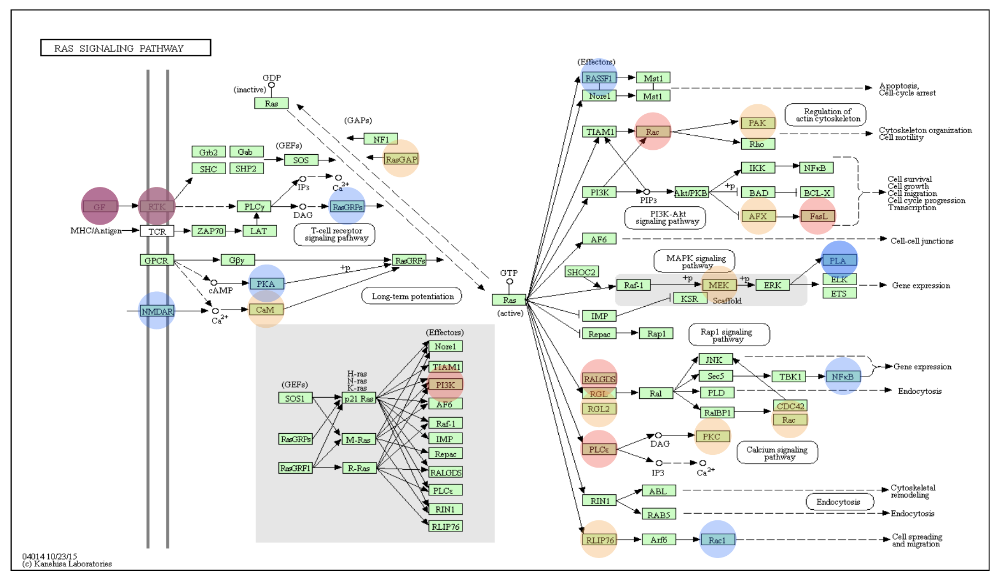
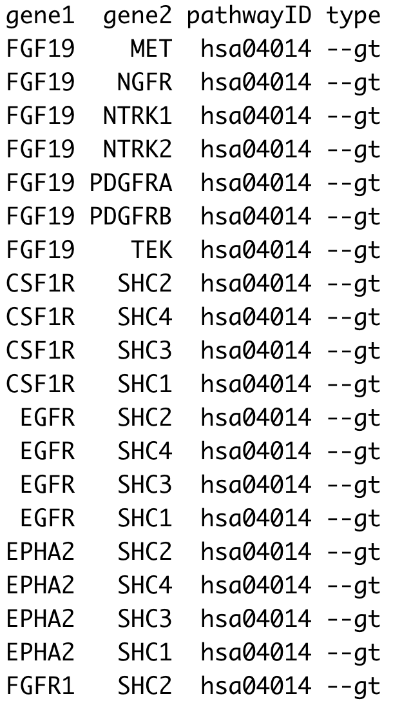
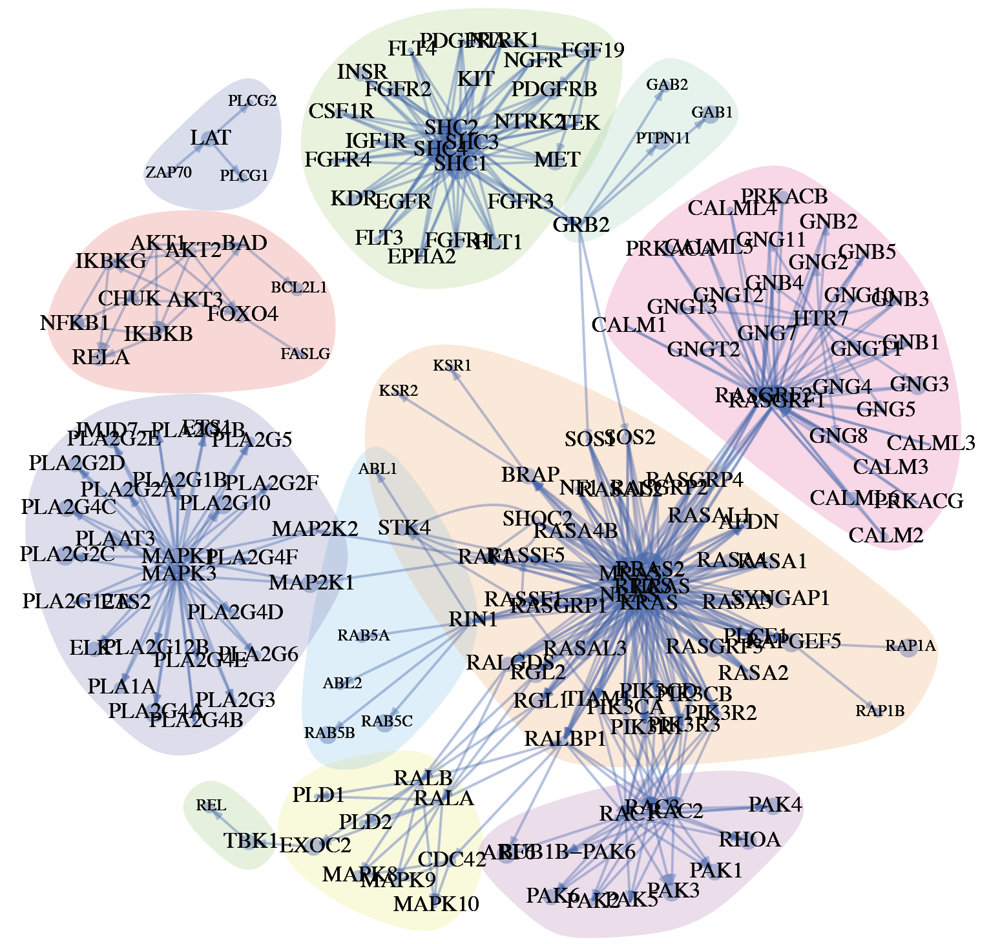
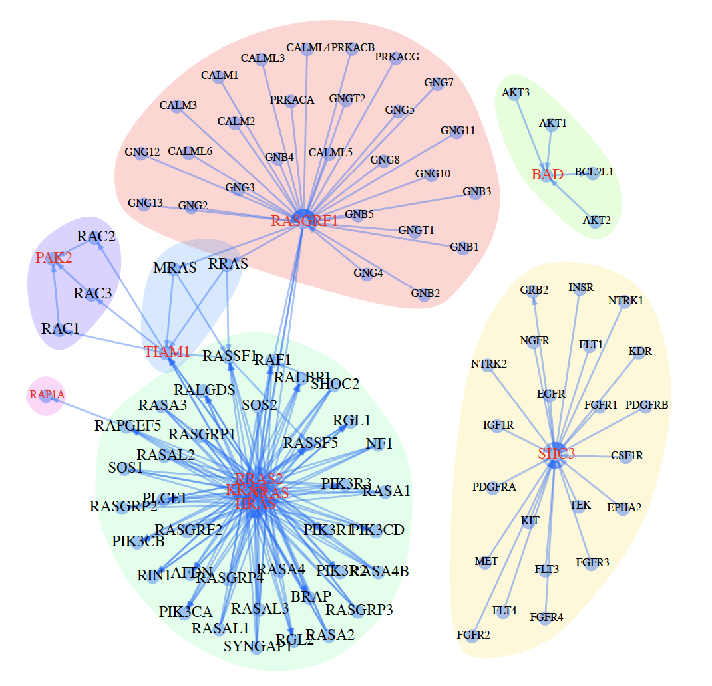
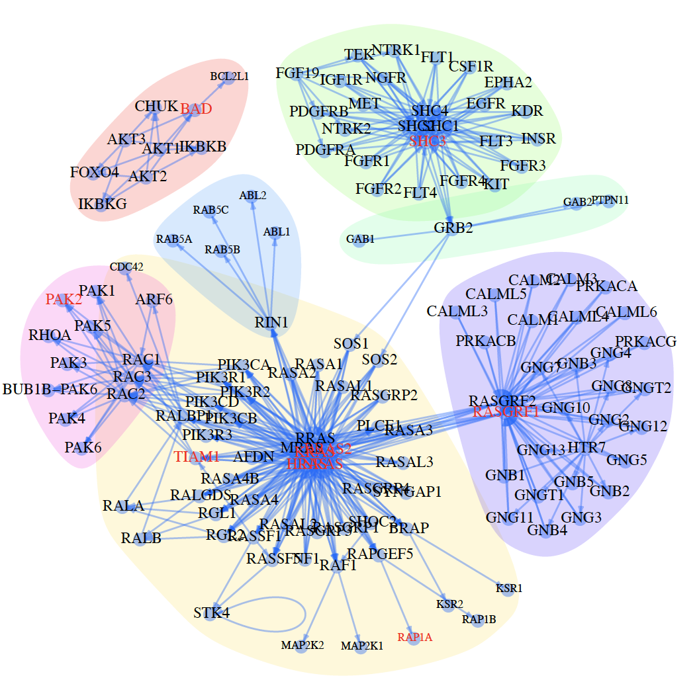
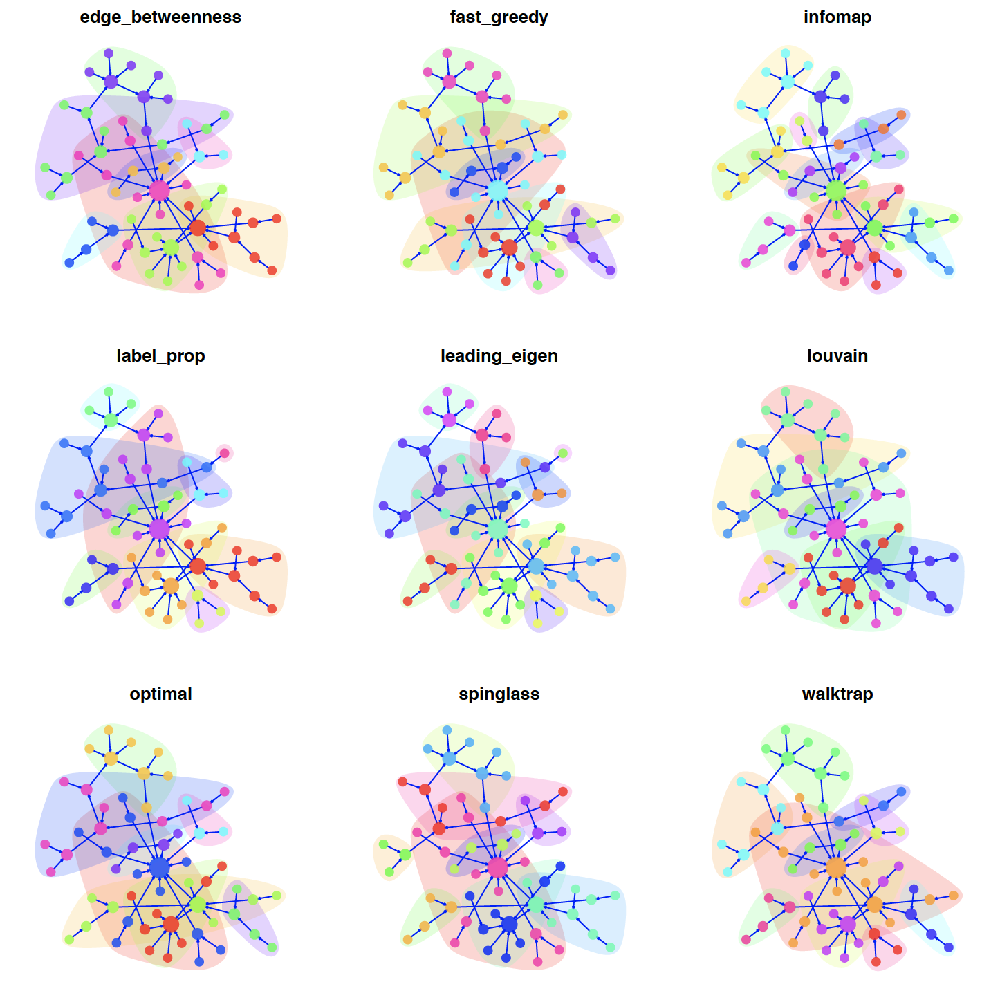

# OmicPath: an R package for gene set enrichment analysis and pathway network analysis 
#### Install the package
```r
library(devtools)
install_github("CBIIT-CGR/OmicPath")
``` 
 
 
# Examples:
### Do GSEA
```r
set.seed(1234);
## get some genes from biosystems database of NCBI
dat   <- read.table(system.file("extdata/biosystems_hs.txt", package = "OmicPath"));
genes <- sample(dat[,1], 200);

## select databases (GO) from the package
db  <- db_names()[1];
## do GSEA
out <- doGSEA(db=db, gene=genes, filter.num=2, fdr=T);
``` 
 
### Map gene information on pathway

  
[code](examples/02do_KEGGplot.R)

### Get pathway gene relationships and plot pathway as network with clusters
  
KEGG: Ras signaling pathway
  
  
  
[code](examples/03plot_network.R)

### Make network by gene neighborhoods in pathway
KEGG: Ras signaling pathway: make networks by the genes ("PAK2", "BAD", "RASGRF1", "RAP1A", "NRAS", "HRAS", "TIAM1", "RRAS2", "KRAS", "SHC3") and the gene's neighborhoods. The networks are the gene neighborhood order = 1 and 2 respectively.

  
  
[code 1 (order=1)](examples/04do_neighborhood_test1.R)
  
[code 2 (order=2)](examples/04do_neighborhood_test2.R)


### Option: cluster algorithms in igraph

  
[code](examples/04do_igraph_cluster.R)
